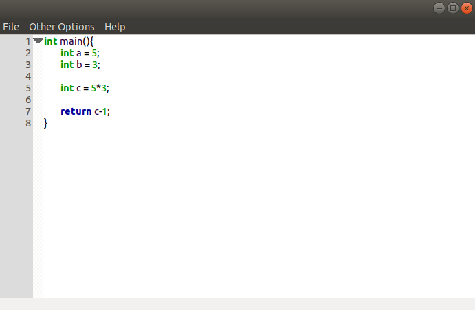
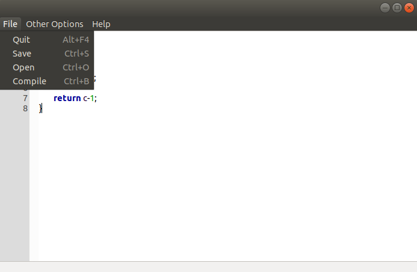
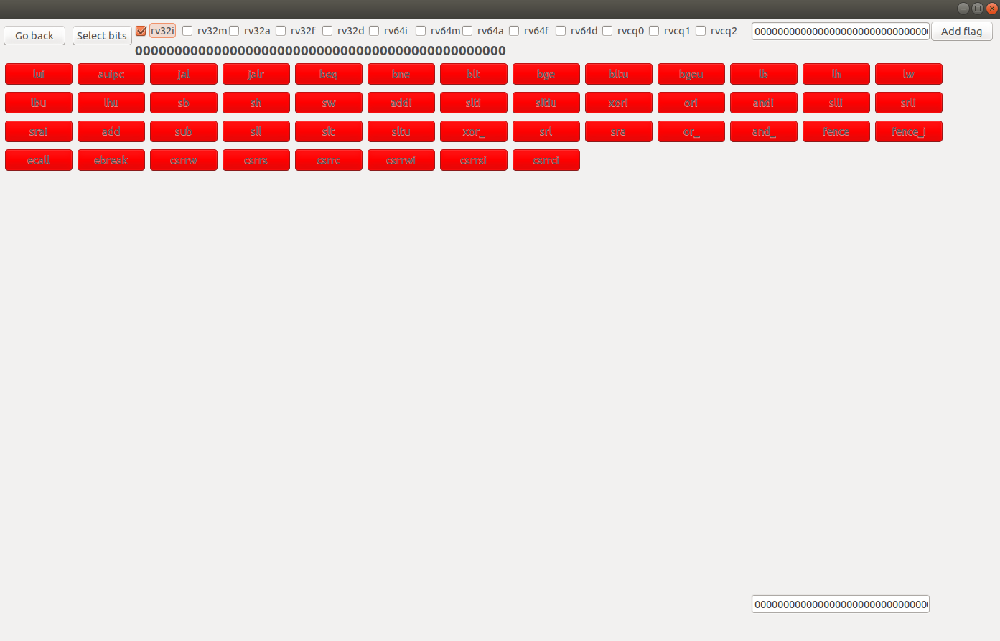
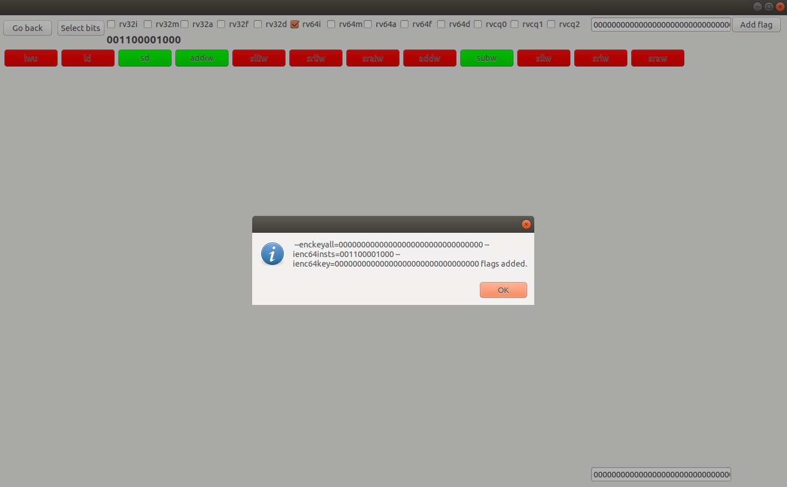
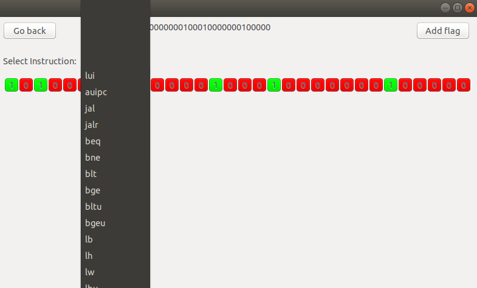
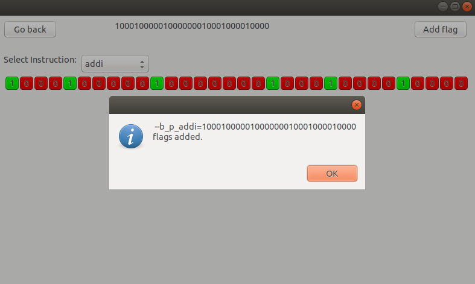

# ERIC - Encryption tool for RISCV with Compiler #
ERIC is an LLVM-based compiler that provides many encryption options for riscv-based systems.

By using ERIC, you can make the programs you compile run on authorized hardware. For this, you need to have a key or password synthesized in your user processor.

In addition, it can be used in cases where you want the data kept in memory to remain encrypted or depending on the needs such as keeping the program securely.

ERIC offers fully customizable encryption. There are currently 3 different encryption methods supported:

### [1. Instruction-Level Full Encryption](https://github.com/kasirgalabs/ERIC/blob/main/README.md#1-instruction-level-full-encryption-1) ###
   
   This method encrypts the instructions one by one. It provides encryption of all instructions in the program by entering a specific key.
   
### [2. Instruction-Level Partial Encryption](https://github.com/kasirgalabs/ERIC/blob/main/README.md#2-instruction-level-partial-encryption-1) ###
 
   This method supports unlimited customization. You can choose the types of instructions you think are critical to your program and only encrypt them. You can also encrypt each instruction to correspond to different bits within itself.
 
### [3. Memory-Level Encryption](https://github.com/kasirgalabs/ERIC/blob/main/README.md#3-memory-level-encryption-1) ###
 
   In this method, you can completely encrypt the program with a public key that we will use in ERIC. Unlike the previous options, all data expected to be in memory here is encrypted with the RSA encryption method. There is encryption not at the instruction level, but as much as the size of the program in memory. You can manually give the public and private key pairs to the system yourself, or you can ask ERIC to automatically generate a public key.


The thing to remember is that ERIC is a compiler with an interface developed for encryption. In order to run the encrypted programs you have compiled here, you need at least some hardware that does decryption. We will soon publish our hardware module that can work in integration with ERIC.


# Requirements #

* [LLVM library](https://github.com/llvm/llvm-project) built for RISCV target (LLVM installation)
* [wxWidgets library](https://github.com/wxWidgets/wxWidgets) built for IDE (wxWidgets installation)

# Required Installations For Linux #

## 1. LLVM Library Installation ##

### 1.1 Necessary Tools Installation ###

#### CMake Installation ####
```bash
sudo snap install cmake --classic
```

#### Ninja Installation ####
```bash
sudo apt install ninja-build
```

### 1.2 LLVM Installation ###

#### Recommended Installation ####
```bash
git clone https://github.com/llvm/llvm-project.git && \
cd llvm-project && \
mkdir build && \ cd build && \
cmake -G Ninja \
-DLLVM_ENABLE_PROJECTS=clang \ 
-DLLVM_TARGETS_TO_BUILD=all \
-DLLVM_ENABLE_LIBCXX=ON \
-DCMAKE_BUILD_TYPE=Release \
-DLLVM_INSTALL_UTILS=ON \
-DBUILD_SHARED_LIBS=True \
-DLLVM_USE_SPLIT_DWARF=True \
-DLLVM_OPTIMIZED_TABLEGEN=True \
-DLLVM_BUILD_TESTS=True \
-DLLVM_PARALLEL_LINK_JOBS=1 ../llvm && \
cmake --build .
```

#### Recommended Light Installation ####
```bash
git clone https://github.com/llvm/llvm-project.git && \
cd llvm-project && \
mkdir build && \
cd build && \
cmake -G Ninja \
-DLLVM_ENABLE_PROJECTS=clang \
-DLLVM_TARGETS_TO_BUILD=RISCV \
-DBUILD_SHARED_LIBS=True \
-DLLVM_PARALLEL_LINK_JOBS=1 ../llvm && \
cmake --build .
```

### 2. wxWidgets Library Installation ###

#### 2.1 Necessary Tools Installation ####
```bash
sudo apt install build-essential
```

```bash
sudo apt install libgtk-3-dev
```

#### 2.2 wxWidgets Installation ####
```bash
git clone https://github.com/wxWidgets/wxWidgets && \
mkdir gtk-build && \
cd gtk-build && \
../configure && \
make && \
sudo make install && \
sudo ldconfig
```

# Cloning Repository #
```bash
git clone https://github.com/kasirgalabs/ERIC
```

# Building Repository #

### 1. Building kasirga Compiler and alp Encryption Tool ###

**1-)** Go to **kasirga-compiler-and-alp** directory. Then create a build directory and change directory:
```bash
cd kasirga-compiler-and-alp
mkdir build
cd build
```

**2-)** Export your LLVM directories:

```bash
export LLVM_PROJECT_DIR={your-llvm-project-directory}
export LLVM_BUILD_DIR={your-llvm-install-or-build-directory}
```

Example:
```bash
export LLVM_PROJECT_DIR=~/llvm/llvm-project
export LLVM_BUILD_DIR=~/llvm/llvm-project/build
```

**3-)** Configure with cmake:

```bash
cmake -DLT_LLVM_INSTALL_DIR=$LLVM_BUILD_DIR -DCMAKE_MODULE_PATH=$LLVM_PROJECT_DIR/clang/cmake/modules ..
```

**4-)** Build with cmake or make:

```bash
cmake --build .
```

Alternative build with make:

```bash
make
```

If you can't build because of a compiler error, install a new compiler if does not exist, change your compiler as for example:

```bash
export CC=clang-11
export CXX=clang++-11
```

then delete build directory and start with the first step again.

You can look for changing compiler that I answered on [stackoverflow](https://stackoverflow.com/questions/68349442/how-to-fix-undefined-reference-llvm-error-while-linking-cxx-executable/68568867#68568867).

**Now you can find your executables in /kasirga-compiler-and-alp/build/bin folder as alp and kasirga variants.**

### 2. Building kasirgaIDE ###
**1-)** Go to **kasirgaIDE** directory. Then create a build directory and change directory:
```bash
cd kasirgaIDE
mkdir build
cd build
```
**2-)** Configure with cmake:
```bash
cmake -G Ninja ..
```

**3-)** Build with cmake or make:

```bash
cmake --build .
```

Alternative build with make:

```bash
make
```

# Usage of Tools and Compiler #

## kasirga ##

You can use clang-like compiler but if you compile a .c code as object code it will also run alp obfuscator and give encrypted or non-encrypted hex code.

**Example usages:**

Host pc executable:

```bash
kasirga example.c -o example
```

Host pc assembly code:

```bash
/home/shc/Desktop/kasirga-compiler/build/bin/kasirga -S example.c -o example.s 
```

Host pc llvm ir code:

```bash
/home/shc/Desktop/kasirga-compiler/build/bin/kasirga -S -emit-llvm example.c -o example.ll 
```

Host pc object code:

```bash
/home/shc/Desktop/kasirga-compiler/build/bin/kasirga -c example.c -o example.o
```

Riscv32 object code (also runs alp):

```bash
/home/shc/Desktop/kasirga-compiler/build/bin/kasirga -c -target riscv32-unknown-elf --sysroot=/home/shc/riscv-new/_install/riscv64-unknown-elf --gcc-toolchain=/home/shc/riscv-new/_install/ example.c -o example.o
```

I am using --sysroot and --gcc-toolchain flags to compile for riscv. You need to have riscv-gnu-toolchain pre installed.
For --sysroot and --gcc-toolchain flags you can look here that I answered: https://stackoverflow.com/questions/68580399/using-clang-to-compile-for-risc-v

## alp ##

You can use to obfuscate any compiled object code to non-encrypted or encrypted hex code. For encryption you have three options:

### 1. Instruction-Level Full Encryption ###

We can use `--enckeyall` flag to encrypt all rv32i, rv32m, rv32a, rv32f, rv32d, rv64i, rv64m, rv64a, rv64f, rv64d, rvc quadrant 0, rvc quadrant 1 and rvc quadrant 2 instructions. (Not supported RSA encryption for now.)

**Usage of the flag:** 
```bash
--enckeyall="<your32bitkeyasbinary>(for 16 bit compressed instructions it uses most significant(left) 16 bit of this as key)"`
```

**Example usage:** 
```bash
/home/shc/ERIC/kasirga-compiler-and-alp/build/bin/alp --enckeyall=10100100101000000000001000000101 -d example.o`
```

### 2. Instruction-Level Partial Encryption ###

We have two options to encrypt hex code partially, extension specific and instruction specific. 

#### 2.1. Instruction-Level Partial Extension Specific Encryption ####

We have 15 flags to extension specific instruction encryption:

```bash
--ienc32insts="<your47bitrv32iinstlistasbinary(use 1 to encrypt corresponding instruction)>"
--menc32insts="<your8bitrv32minstlistasbinary(use 1 to encrypt corresponding instruction)>"
--aenc32insts="<your11bitrv32ainstlistasbinary(use 1 to encrypt corresponding instruction)>"
--fenc32insts="<your26bitrv32finstlistasbinary(use 1 to encrypt corresponding instruction)>"
--denc32insts="<your26bitrv32dinstlistasbinary(use 1 to encrypt corresponding instruction)>"

--ienc64insts="<your15bitrv64iinstlistasbinary(use 1 to encrypt corresponding instruction)>"
--menc64insts="<your5bitrv64minstlistasbinary(use 1 to encrypt corresponding instruction)>"
--aenc64insts="<your11bitrv64ainstlistasbinary(use 1 to encrypt corresponding instruction)>"
--fenc64insts="<your4bitrv64finstlistasbinary(use 1 to encrypt corresponding instruction)>"
--denc64insts="<your6bitrv64dinstlistasbinary(use 1 to encrypt corresponding instruction)>"

--cencq0insts="<your11bitrvcq0instlistasbinary(use 1 to encrypt corresponding instruction)>"
--cencq1insts="<your21bitrvcq1instlistasbinary(use 1 to encrypt corresponding instruction)>"
--cencq2insts="<your17bitrvcq2instlistasbinary(use 1 to encrypt corresponding instruction)>"
```

and 15 key flags to encrypt given instructions by extension:

```bash
--ienc32key="<your32bitkeyasbinary>"
--menc32key="<your32bitkeyasbinary>"
--aenc32key="<your32bitkeyasbinary>"
--fenc32key="<your32bitkeyasbinary>"
--denc32key="<your32bitkeyasbinary>"

--ienc64key="<your32bitkeyasbinary>"
--menc64key="<your32bitkeyasbinary>"
--aenc64key="<your32bitkeyasbinary>"
--fenc64key="<your32bitkeyasbinary>"
--denc64key="<your32bitkeyasbinary>"

--cencq0key="<your16bitkeyasbinary>"
--cencq1key="<your16bitkeyasbinary>"
--cencq2key="<your16bitkeyasbinary>"
```

Also we have instruction flags as seperately instead of instruction bit lists (they can be used interchangeably):

<details> <summary> <b> Encryptable rv32i Instruction List (47 instructions, most left bit is 0. most right bit is 46. instruction of --ienc32insts) </b> </summary>
   
**0 -)** ``` --lui ```

**1 -)** ``` --auipc ```

**2 -)** ``` --jal ```

**3 -)** ``` --jalr ```

**4 -)** ``` --beq ```

**5 -)** ``` --bne ```

**6 -)** ``` --blt ```

**7 -)** ``` --bge ```

**8 -)** ``` --bltu ```

**9 -)** ``` --bgeu ```

**10-)** ``` --lb ```

**11-)** ``` --lh ```

**12-)** ``` --lw ```

**13-)** ``` --lbu ```

**14-)** ``` --lhu ```

**15-)** ``` --sb ```

**16-)** ``` --sh ```

**17-)** ``` --sw ```

**18-)** ``` --addi ```

**19-)** ``` --slti ```

**20-)** ``` --sltiu ```

**21-)** ``` --xori ```

**22-)** ``` --ori ```

**23-)** ``` --andi ```

**24-)** ``` --slli ```

**25-)** ``` --srli ```

**26-)** ``` --srai ```

**27-)** ``` --add ```

**28-)** ``` --sub ```

**29-)** ``` --sll ```

**30-)** ``` --slt ```

**31-)** ``` --sltu ```

**32-)** ``` --xor_ ```

**33-)** ``` --srl ```

**34-)** ``` --sra ```

**35-)** ``` --or_ ```

**36-)** ``` --and_ ```

**37-)** ``` --fence ```

**38-)** ``` --fence_i ```

**39-)** ``` --ecall ```

**40-)** ``` --ebreak ```

**41-)** ``` --csrrw ```

**42-)** ``` --csrrs ```

**43-)** ``` --csrrc ```

**44-)** ``` --csrrwi ```

**45-)** ``` --csrrsi ```

**46-)** ``` --csrrci ```
   
</details>

<details> <summary> <b> Encryptable rv32m Instruction List (8 instructions, most left bit is 0. most right bit is 7. instruction of --menc32insts) </b> </summary>
   
**0 -)** ``` --mul ```

**1 -)** ``` --mulh ``` 

**2 -)** ``` --mulhsu ``` 

**3 -)** ``` --mulhu ``` 

**4 -)** ``` --div_ ```

**5 -)** ``` --divu ``` 

**6 -)** ``` --rem ```

**7 -)** ``` --remu ```

</details>

#### 2.2. Instruction-Level Partial Instruction Specific Encryption ####

### 3. Memory-Level Encryption ###


**Example usages:**

Gives output as non-encrypted out.hex:

```bash
alp -d example.o
```

Gives output as add, sub instructions encrypted out.hex:

```bash
/home/shc/Desktop/kasirga-compiler/build/bin/alp --add --sub -d example.o
```

Gives output as non-encrypted out.hex (bits' length 90):

```bash
/home/shc/Desktop/kasirga-compiler/build/bin/alp --bits 000000000000000000000000000000000000000000000000000000000000000000000000000000000000000000 -d example.o
```

Gives output as some instructions encrypted out.hex (most left bit is 0. most right bit is 89. instruction):

```bash
/home/shc/Desktop/kasirga-compiler/build/bin/alp --bits 100000000000000001011001011001000001000100100100010100001010000010001111001000000000000000 -d example.o
```

Gives output as some instructions encrypted out.hex (most left bit is 0. most right bit is 89. instruction):

```bash
/home/shc/Desktop/kasirga-compiler/build/bin/alp --addi --bits=100000000000000001011001011001000001000100100100010100001010000010001111001000000000000000 -d example.o
```

<details> <summary> <b> Encryptable Instruction List (90 instructions, most left bit is 0. most right bit is 89. instruction): </b> </summary>
  
**0 -)** beq

**1 -)** bne

**2 -)** blt

**3 -)** bge

**4 -)** bltu

**5 -)** bgeu

**6 -)** jalr

**7 -)** jal

**8 -)** lui

**9 -)** auipc

**10-)** addi

**11-)** slli

**12-)** slti

**13-)** sltiu

**14-)** xori

**15-)** srli

**16-)** srai

**17-)** ori

**18-)** andi

**19-)** add

**20-)** sub

**21-)** sll

**22-)** slt

**23-)** sltu

**24-)** xor_

**25-)** srl

**26-)** sra

**27-)** or_

**28-)** and_

**29-)** addiw

**30-)** slliw

**31-)** srliw

**32-)** sraiw

**33-)** addw

**34-)** subw

**35-)** sllw

**36-)** srlw

**37-)** sraw

**38-)** lb

**39-)** lh

**40-)** lw

**41-)** ld

**42-)** lbu

**43-)** lhu

**44-)** lwu

**45-)** sb

**46-)** sh

**47-)** sw

**48-)** sd

**49-)** fence

**50-)** fence_i

**51-)** mul

**52-)** mulh

**53-)** mulhsu

**54-)** mulhu

**55-)** div

**56-)** divu

**57-)** rem

**58-)** remu

**59-)** mulw

**60-)** divw

**61-)** divuw

**62-)** remw

**63-)** remuw

**64-)** lr_w

**65-)** sc_w

**66-)** lr_d

**67-)** sc_d

**68-)** ecall

**69-)** ebreak

**70-)** uret

**71-)** mret

**72-)** dret

**73-)** sfence_vma

**74-)** wfi

**75-)** csrrw

**76-)** csrrs

**77-)** csrrc

**78-)** csrrwi

**79-)** csrrsi

**80-)** csrrci

**81-)** slli_rv32

**82-)** srli_rv32

**83-)** srai_rv32

**84-)** rdcycle

**85-)** rdtime

**86-)** rdinstret

**87-)** rdcycleh

**88-)** rdtimeh

**89-)** rdinstreth
  
</details>


# Screenshots #













