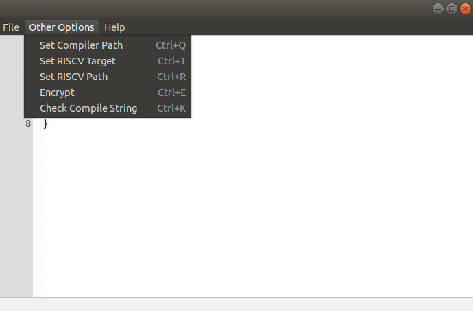

# ERIC - An Efficient and Practical Software Obfuscation Framework #


ERIC (Encryption tool for RISCV with Compiler) has an LLVM-based compiler that provides many encryption options for riscv-based systems.

By using ERIC, you can make the programs you compile run on authorized hardware. For this, you need to have a key or password synthesized in your user processor.

In addition, it can be used in cases where you want the data kept in memory to remain encrypted or depending on the needs such as keeping the program securely.

ERIC offers fully customizable encryption. There are currently 2 different encryption methods supported:

### [1. Instruction-Level Full Encryption](https://github.com/Celuk/ERIC/blob/main/README.md#1-instruction-level-full-encryption-1) ###
   
   This method encrypts the instructions one by one. It provides encryption of all instructions in the program by entering a specific key.
   
### [2. Instruction-Level Partial Encryption](https://github.com/Celuk/ERIC/blob/main/README.md#2-instruction-level-partial-encryption-1) ###
 
   This method supports unlimited customization. You can choose the types of instructions you think are critical to your program and only encrypt them. You can also encrypt each instruction to correspond to different bits within itself.

### [3. Memory-Level Encryption](https://github.com/Celuk/ERIC#3-memory-level-encryption) ###

In this method, you can completely encrypt the program with a public key that we will use in ERIC. Unlike the previous options, all data expected to be in memory here is encrypted with the RSA encryption method. There is encryption not at the instruction level, but as much as the size of the program in memory. You can give `--rsa` flag to use 32 bit RSA encryption and manually give the public and private key pairs to the system yourself [internally](https://github.com/Celuk/ERIC/blob/main/clangport-and-elf2encryptedhex/src/elf2encryptedhex/elf2encryptedhex.cpp#L84).

The thing to remember is that ERIC is a compiler with an interface developed for encryption. In order to run the encrypted programs you have compiled here, you need at least some hardware that does decryption. We will soon publish our hardware module that can work in integration with ERIC.

# Dependencies #

* [LLVM library](https://github.com/llvm/llvm-project) built for RISCV target (LLVM installation)
* [wxWidgets library](https://github.com/wxWidgets/wxWidgets) built for IDE (wxWidgets installation)
* [riscv-gnu-toolchain library](https://github.com/riscv-collab/riscv-gnu-toolchain) built for using standard headers (e.g. stdio.h) (riscv-gnu-toolchain installation)

# Required Installations For Linux #

## 1. LLVM Library Installation ##

### 1.1 Necessary Tools Installation ###

#### CMake Installation ####
```bash
sudo snap install cmake --classic
```

#### Ninja Installation ####
```bash
sudo apt install ninja-build
```

### 1.2 LLVM Installation ###

#### Recommended Installation ####
Here normally you can clone LLVM library as:

```bash
git clone https://github.com/llvm/llvm-project.git
```

However we are using LLVM 11.1.0, so download from: https://github.com/llvm/llvm-project/archive/refs/tags/llvmorg-11.1.0.zip
unzip and after that for build:

```bash
cd llvm-project-llvmorg-11.1.0 && \
mkdir build && \ 
cd build && \
cmake -G Ninja \
-DLLVM_ENABLE_PROJECTS=clang \ 
-DLLVM_TARGETS_TO_BUILD=all \
-DLLVM_ENABLE_LIBCXX=ON \
-DCMAKE_BUILD_TYPE=Release \
-DLLVM_INSTALL_UTILS=ON \
-DBUILD_SHARED_LIBS=True \
-DLLVM_USE_SPLIT_DWARF=True \
-DLLVM_OPTIMIZED_TABLEGEN=True \
-DLLVM_BUILD_TESTS=True \
-DLLVM_PARALLEL_LINK_JOBS=1 ../llvm && \
cmake --build .
```

#### Recommended Light Installation ####

```bash
cd llvm-project-llvmorg-11.1.0 && \
mkdir build && \
cd build && \
cmake -G Ninja \
-DLLVM_ENABLE_PROJECTS=clang \
-DLLVM_TARGETS_TO_BUILD=RISCV \
-DBUILD_SHARED_LIBS=True \
-DLLVM_PARALLEL_LINK_JOBS=1 ../llvm && \
cmake --build .
```

### 2. wxWidgets Library Installation ###

#### 2.1 Necessary Tools Installation ####
```bash
sudo apt install build-essential
```

```bash
sudo apt install libgtk-3-dev
```

#### 2.2 wxWidgets Installation ####
```bash
git clone https://github.com/wxWidgets/wxWidgets && \
cd wxWidgets && \
mkdir gtk-build && \
cd gtk-build && \
../configure && \
make && \
sudo make install && \
sudo ldconfig
```

# Cloning Repository #
```bash
git clone https://github.com/Celuk/ERIC
```

# Building Repository #

### 1. Building clangport Compiler and elf2encryptedhex Encryption Tool ###

**1-)** Go to **clangport-and-elf2encryptedhex** directory. Then create a build directory and change directory:
```bash
cd clangport-and-elf2encryptedhex
mkdir build
cd build
```

**2-)** Export your LLVM directories(LLVM build and main directory are seperated because build directory can be anywhere):

```bash
export LLVM_PROJECT_DIR={your-llvm-project-directory} # LLVM main directory
export LLVM_DIR={your-llvm-install-or-build-directory} # LLVM build directory
```

Example:
```bash
export LLVM_PROJECT_DIR=~/llvm/llvm-project
export LLVM_DIR=~/llvm/llvm-project/build
```

**3-)** Configure with cmake:

```bash
cmake -G Ninja -DLT_LLVM_INSTALL_DIR=$LLVM_DIR -DCMAKE_MODULE_PATH=$LLVM_PROJECT_DIR/clang/cmake/modules ..
```

**4-)** Build with cmake or make:

```bash
cmake --build .
```

Alternative build with make:

```bash
make
```

If you can't build because of a compiler error, install a new compiler if does not exist, change your compiler as for example:

```bash
export CC=clang-11
export CXX=clang++-11
```

then delete build directory and start with the first step again.
Even if this does not change your compiler, you can try set your compilers at 3. step (while configuring with cmake) with `-DCMAKE_C_COMPILER={your-c-compiler}` and `-DCMAKE_CXX_COMPILER={your-c++-compiler}` flags. Try either with `gcc` or `clang`. Here is an example configuration:

```bash
cmake -G Ninja -DCMAKE_C_COMPILER=gcc -DCMAKE_CXX_COMPILER=g++ -DLT_LLVM_INSTALL_DIR=$LLVM_BUILD_DIR -DCMAKE_MODULE_PATH=$LLVM_PROJECT_DIR/clang/cmake/modules ..
```

Further information, you can look for changing compiler that answered on [stackoverflow](https://stackoverflow.com/questions/68349442/how-to-fix-undefined-reference-llvm-error-while-linking-cxx-executable/68568867#68568867).

**Now you can find your executables in /clangport-and-elf2encryptedhex/build/bin folder as elf2encryptedhex and clangport variants.**

### 2. Building encIDE ###
**1-)** Go to **encIDE** directory. Then create a build directory and change directory:
```bash
cd encIDE
mkdir build
cd build
```
**2-)** Configure with cmake:
```bash
cmake -G Ninja ..
```

**3-)** Build with cmake or make:

```bash
cmake --build .
```

Alternative build with make:

```bash
make
```

# Usage of Tools, Compiler and IDE #

## elf2encryptedhex LLVM Based Encryptor and Hex Generator ##

You can use 'elf2encryptedhex' to obfuscate any compiled object code to non-encrypted or encrypted hex code. For encryption you have three options:

### [1. Instruction-Level Full Encryption](https://github.com/Celuk/ERIC/blob/main/README.md#1-instruction-level-full-encryption) ###

We can use `--enckeyall` flag to encrypt all rv32i, rv32m, rv32a, rv32f, rv32d, rv64i, rv64m, rv64a, rv64f, rv64d, rvc quadrant 0, rvc quadrant 1 and rvc quadrant 2 instructions. (Not supported RSA encryption for now.)

**Usage of the flag:** 
```bash
--enckeyall="<your32bitkeyasbinary>(for 16 bit compressed instructions it uses most significant(left) 16 bit of this as key)"
```

**Example usage:** 
```bash
/home/shc/ERIC/clangport-and-elf2encryptedhex/build/bin/elf2encryptedhex --enckeyall="10100100101000000000001000000101" -d example.o
```

This will xor all instructions (all of hex code) with given enckeyall.

(

In example

**32 bit instructions (rv32, rv64)** xor **10100100101000000000001000000101**

**16 bit instructions (rvc)** xor **1010010010100000** (most left 16 bit of enckeyall)

)


### [2. Instruction-Level Partial Encryption](https://github.com/Celuk/ERIC/blob/main/README.md#2-instruction-level-partial-encryption) ###

We have two options to encrypt hex code partially, extension specific and instruction specific. 

#### [2.1. Instruction-Level Partial Extension Specific Encryption](https://github.com/Celuk/ERIC/blob/main/README.md#21-instruction-level-partial-extension-specific-encryption) ####

We have 15 flags (+2 unsupported rvq extension flags) to extension specific instruction encryption:

```bash
--ienc32insts="<your47bitrv32iinstlistasbinary(use 1 to encrypt corresponding instruction)>"
--menc32insts="<your8bitrv32minstlistasbinary(use 1 to encrypt corresponding instruction)>"
--aenc32insts="<your11bitrv32ainstlistasbinary(use 1 to encrypt corresponding instruction)>"
--fenc32insts="<your26bitrv32finstlistasbinary(use 1 to encrypt corresponding instruction)>"
--denc32insts="<your26bitrv32dinstlistasbinary(use 1 to encrypt corresponding instruction)>"

*** --qenc32insts="<your28bitrv32qinstlistasbinary(use 1 to encrypt corresponding instruction)>" ***  --> not supported yet

--ienc64insts="<your15bitrv64iinstlistasbinary(use 1 to encrypt corresponding instruction)>"
--menc64insts="<your5bitrv64minstlistasbinary(use 1 to encrypt corresponding instruction)>"
--aenc64insts="<your11bitrv64ainstlistasbinary(use 1 to encrypt corresponding instruction)>"
--fenc64insts="<your4bitrv64finstlistasbinary(use 1 to encrypt corresponding instruction)>"
--denc64insts="<your6bitrv64dinstlistasbinary(use 1 to encrypt corresponding instruction)>"

*** --qenc64insts="<your4bitrv64qinstlistasbinary(use 1 to encrypt corresponding instruction)>" ***  --> not supported yet

--cencq0insts="<your11bitrvcq0instlistasbinary(use 1 to encrypt corresponding instruction)>"
--cencq1insts="<your21bitrvcq1instlistasbinary(use 1 to encrypt corresponding instruction)>"
--cencq2insts="<your17bitrvcq2instlistasbinary(use 1 to encrypt corresponding instruction)>"
```

and 15 key flags (+2 unsupported rvq extension flags) to encrypt given instructions by extension:

```bash
--ienc32key="<your32bitkeyasbinary>"
--menc32key="<your32bitkeyasbinary>"
--aenc32key="<your32bitkeyasbinary>"
--fenc32key="<your32bitkeyasbinary>"
--denc32key="<your32bitkeyasbinary>"

*** --qenc32key="<your32bitkeyasbinary>" ***  --> not supported yet

--ienc64key="<your32bitkeyasbinary>"
--menc64key="<your32bitkeyasbinary>"
--aenc64key="<your32bitkeyasbinary>"
--fenc64key="<your32bitkeyasbinary>"
--denc64key="<your32bitkeyasbinary>"

*** --qenc64key="<your32bitkeyasbinary>" ***  --> not supported yet

--cencq0key="<your16bitkeyasbinary>"
--cencq1key="<your16bitkeyasbinary>"
--cencq2key="<your16bitkeyasbinary>"
```

Also we have instruction flags as seperately instead of instruction bit lists. (They can be used interchangeably.) Instruction encryption flags can be seen as spoilers below. (Dots are converted to underscores in instructions which containing dots.)

<details> <summary> <b> Encryptable rv32i Instruction List (47 instructions, most left bit is 0. most right bit is 46. instruction of --ienc32insts) </b> </summary>
   
***0 -)*** ``` --lui ```

***1 -)*** ``` --auipc ```

***2 -)*** ``` --jal ```

***3 -)*** ``` --jalr ```

***4 -)*** ``` --beq ```

***5 -)*** ``` --bne ```

***6 -)*** ``` --blt ```

***7 -)*** ``` --bge ```

***8 -)*** ``` --bltu ```

***9 -)*** ``` --bgeu ```

***10-)*** ``` --lb ```

***11-)*** ``` --lh ```

***12-)*** ``` --lw ```

***13-)*** ``` --lbu ```

***14-)*** ``` --lhu ```

***15-)*** ``` --sb ```

***16-)*** ``` --sh ```

***17-)*** ``` --sw ```

***18-)*** ``` --addi ```

***19-)*** ``` --slti ```

***20-)*** ``` --sltiu ```

***21-)*** ``` --xori ```

***22-)*** ``` --ori ```

***23-)*** ``` --andi ```

***24-)*** ``` --slli ```

***25-)*** ``` --srli ```

***26-)*** ``` --srai ```

***27-)*** ``` --add ```

***28-)*** ``` --sub ```

***29-)*** ``` --sll ```

***30-)*** ``` --slt ```

***31-)*** ``` --sltu ```

***32-)*** ``` --xor_ ```

***33-)*** ``` --srl ```

***34-)*** ``` --sra ```

***35-)*** ``` --or_ ```

***36-)*** ``` --and_ ```

***37-)*** ``` --fence ```

***38-)*** ``` --fence_i ```

***39-)*** ``` --ecall ```

***40-)*** ``` --ebreak ```

***41-)*** ``` --csrrw ```

***42-)*** ``` --csrrs ```

***43-)*** ``` --csrrc ```

***44-)*** ``` --csrrwi ```

***45-)*** ``` --csrrsi ```

***46-)*** ``` --csrrci ```
   
</details>


<details> <summary> <b> Encryptable rv32m Instruction List (8 instructions, most left bit is 0. most right bit is 7. instruction of --menc32insts) </b> </summary>
   
***0 -)*** ``` --mul ```

***1 -)*** ``` --mulh ``` 

***2 -)*** ``` --mulhsu ``` 

***3 -)*** ``` --mulhu ``` 

***4 -)*** ``` --div_ ```

***5 -)*** ``` --divu ``` 

***6 -)*** ``` --rem ```

***7 -)*** ``` --remu ```

</details>

<details> <summary> <b> Encryptable rv32a Instruction List (11 instructions, most left bit is 0. most right bit is 10. instruction of --aenc32insts) </b> </summary>
   
***0 -)*** ``` --lr_w ```

***1 -)*** ``` --sc_w ```

***2 -)*** ``` --amoswap_w ```

***3 -)*** ``` --amoadd_w ```

***4 -)*** ``` --amoxor_w ```

***5 -)*** ``` --amoand_w ```

***6 -)*** ``` --amoor_w ```

***7 -)*** ``` --amomin_w ```

***8 -)*** ``` --amomax_w ```

***9 -)*** ``` --amominu_w ```

***10-)*** ``` --amomaxu_w ```

</details>

<details> <summary> <b> Encryptable rv32f Instruction List (26 instructions, most left bit is 0. most right bit is 25. instruction of --fenc32insts) </b> </summary>
   
***0 -)*** ``` --flw ```

***1 -)*** ``` --fsw ```

***2 -)*** ``` --fmadd_s ```

***3 -)*** ``` --fmsub_s ```

***4 -)*** ``` --fnmsub_s ```

***5 -)*** ``` --fnmadd_s ```

***6 -)*** ``` --fadd_s ```

***7 -)*** ``` --fsub_s ```

***8 -)*** ``` --fmul_s ```

***9 -)*** ``` --fdiv_s ```

***10-)*** ``` --fsqrt_s ```

***11-)*** ``` --fsgnj_s ```

***12-)*** ``` --fsgnjn_s ```

***13-)*** ``` --fsgnjx_s ```

***14-)*** ``` --fmin_s ```

***15-)*** ``` --fmax_s ```

***16-)*** ``` --fcvt_w_s ```

***17-)*** ``` --fcvt_wu_s ```

***18-)*** ``` --fmv_x_w ```

***19-)*** ``` --feq_s ```

***20-)*** ``` --flt_s ```

***21-)*** ``` --fle_s ```

***22-)*** ``` --fclass_s ```

***23-)*** ``` --fcvt_s_w ```

***24-)*** ``` --fcvt_s_wu ```

***25-)*** ``` --fmv_w_x ```

</details>

<details> <summary> <b> Encryptable rv32d Instruction List (26 instructions, most left bit is 0. most right bit is 25. instruction of --denc32insts) </b> </summary>
   
***0 -)*** ``` --fld ```

***1 -)*** ``` --fsd ```

***2 -)*** ``` --fmadd_d ```

***3 -)*** ``` --fmsub_d ```

***4 -)*** ``` --fnmsub_d ```

***5 -)*** ``` --fnmadd_d ```

***6 -)*** ``` --fadd_d ```

***7 -)*** ``` --fsub_d ```

***8 -)*** ``` --fmul_d ```

***9 -)*** ``` --fdiv_d ```

***10-)*** ``` --fsqrt_d ```

***11-)*** ``` --fsgnj_d ```

***12-)*** ``` --fsgnjn_d ```

***13-)*** ``` --fsgnjx_d ```

***14-)*** ``` --fmin_d ```

***15-)*** ``` --fmax_d ```

***16-)*** ``` --fcvt_s_d ```

***17-)*** ``` --fcvt_d_s ```

***18-)*** ``` --feq_d ```

***19-)*** ``` --flt_d ```

***20-)*** ``` --fle_d ```

***21-)*** ``` --fclass_d ```

***22-)*** ``` --fcvt_w_d ```

***23-)*** ``` --fcvt_wu_d ```

***24-)*** ``` --fcvt_d_w ```

***25-)*** ``` --fcvt_d_wu ```

</details>

<details> <summary> <b> <i> (Not supported yet) Encryptable rv32q Instruction List (28 instructions, most left bit is 0. most right bit is 27. instruction of --qenc32insts) </i> </b> </summary>

```bash

***0 -)*** ``` --flq ```        --> *** not supported yet ***               

***1 -)*** ``` --fsq ```        --> *** not supported yet ***     

***2 -)*** ``` --fmadd_q ```    --> *** not supported yet ***         

***3 -)*** ``` --fmsub_q ```    --> *** not supported yet ***         

***4 -)*** ``` --fnmsub_q ```   --> *** not supported yet ***          

***5 -)*** ``` --fnmadd_q ```   --> *** not supported yet ***          

***6 -)*** ``` --fadd_q ```     --> *** not supported yet ***        

***7 -)*** ``` --fsub_q ```     --> *** not supported yet ***        

***8 -)*** ``` --fmul_q ```     --> *** not supported yet ***        

***9 -)*** ``` --fdiv_q ```     --> *** not supported yet ***        

***10-)*** ``` --fsqrt_q ```    --> *** not supported yet ***         

***11-)*** ``` --fsgnj_q ```    --> *** not supported yet ***         

***12-)*** ``` --fsgnjn_q ```   --> *** not supported yet ***          

***13-)*** ``` --fsgnjx_q ```   --> *** not supported yet ***          

***14-)*** ``` --fmin_q ```     --> *** not supported yet ***        

***15-)*** ``` --fmax_q ```     --> *** not supported yet ***        

***16-)*** ``` --fcvt_s_q ```   --> *** not supported yet ***          

***17-)*** ``` --fcvt_q_s ```   --> *** not supported yet ***          

***18-)*** ``` --fcvt_d_q ```   --> *** not supported yet ***          

***19-)*** ``` --fcvt_q_d ```   --> *** not supported yet ***          

***20-)*** ``` --feq_q ```      --> *** not supported yet ***       

***21-)*** ``` --flt_q ```      --> *** not supported yet ***       

***22-)*** ``` --fle_q ```      --> *** not supported yet ***       

***23-)*** ``` --fclass_q ```   --> *** not supported yet ***          

***24-)*** ``` --fcvt_w_q ```   --> *** not supported yet ***          

***25-)*** ``` --fcvt_wu_q ```  --> *** not supported yet ***           

***26-)*** ``` --fcvt_q_w ```   --> *** not supported yet ***          

***27-)*** ``` --fcvt_q_wu ```  --> *** not supported yet ***

```

</details>

<details> <summary> <b> Encryptable rv64i Instruction List (15 instructions, most left bit is 0. most right bit is 14. instruction of --ienc64insts) </b> </summary>

***0 -)*** ``` --lwu ```

***1 -)*** ``` --ld ```

***2 -)*** ``` --sd ```

```bash

*** 3 -) *** --slli  --> *** not supported yet ***

*** 4 -) *** --srli  --> *** not supported yet ***

*** 5 -) *** --srai  --> *** not supported yet ***

```

***6 -)*** ``` --addiw ```

***7 -)*** ``` --slliw ```

***8 -)*** ``` --srliw ```

***9 -)*** ``` --sraiw ```

***10-)*** ``` --addw ```

***11-)*** ``` --subw ```

***12-)*** ``` --sllw ```

***13-)*** ``` --srlw ```

***14-)*** ``` --sraw ```

</details>

<details> <summary> <b> Encryptable rv64m Instruction List (5 instructions, most left bit is 0. most right bit is 4. instruction of --menc64insts) </b> </summary>

***0 -)*** ``` --mulw ```

***1 -)*** ``` --divw ```

***2 -)*** ``` --divuw ```

***3 -)*** ``` --remw ```

***4 -)*** ``` --remuw ```

</details>

<details> <summary> <b> Encryptable rv64a Instruction List (11 instructions, most left bit is 0. most right bit is 10. instruction of --aenc64insts) </b> </summary>

***0 -)*** ``` --lr_d ```

***1 -)*** ``` --sc_d ```

***2 -)*** ``` --amoswap_d ```

***3 -)*** ``` --amoadd_d ```

***4 -)*** ``` --amoxor_d ```

***5 -)*** ``` --amoand_d ```

***6 -)*** ``` --amoor_d ```

***7 -)*** ``` --amomin_d ```

***8 -)*** ``` --amomax_d ```

***9 -)*** ``` --amominu_d ```

***10-)*** ``` --amomaxu_d ```

</details>

<details> <summary> <b> Encryptable rv64f Instruction List (4 instructions, most left bit is 0. most right bit is 3. instruction of --fenc64insts) </b> </summary>

***0 -)*** ``` --fcvt_l_s ```

***1 -)*** ``` --fcvt_lu_s ```

***2 -)*** ``` --fcvt_s_l ```

***3 -)*** ``` --fcvt_s_lu ```

</details>

<details> <summary> <b> Encryptable rv64d Instruction List (6 instructions, most left bit is 0. most right bit is 5. instruction of --fenc64insts) </b> </summary>

***0 -)*** ``` --fcvt_l_d ```

***1 -)*** ``` --fcvt_lu_d ```

***2 -)*** ``` --fmv_x_d ```

***3 -)*** ``` --fcvt_d_l ```

***4 -)*** ``` --fcvt_d_lu ```

***5 -)*** ``` --fmv_d_x ```

</details>

<details> <summary> <b> <i> (Not supported yet) Encryptable rv64q Instruction List (4 instructions, most left bit is 0. most right bit is 3. instruction of --qenc64insts) </i> </b> </summary>

```bash

***0 -)*** --fcvt_l_q   --> *** not supported yet ***

***1 -)*** --fcvt_lu_q  --> *** not supported yet ***

***2 -)*** --fcvt_q_l   --> *** not supported yet ***

***3 -)*** --fcvt_q_lu  --> *** not supported yet ***

```

</details>

<details> <summary> <b> Encryptable rvc quadrant 0 Instruction List (11 instructions, most left bit is 0. most right bit is 10. instruction of --cencq0insts) </b> </summary>

***0 -)*** ``` --c_addi4spn ```

***1 -)*** ``` --c_fld ```

```bash
***2 -)*** ``` --c_lq ```  --> *** not supported yet ***
```

***3 -)*** ``` --c_lw ```

***4 -)*** ``` --c_flw ```

***5 -)*** ``` --c_ld ```

***6 -)*** ``` --c_fsd ```

```bash
***7 -)*** ``` --c_sq ```  --> *** not supported yet ***
```

***8 -)*** ``` --c_sw ```

***9 -)*** ``` --c_fsw ```

***10-)*** ``` --c_sd ```

</details>

<details> <summary> <b> Encryptable rvc quadrant 1 Instruction List (21 instructions, most left bit is 0. most right bit is 20. instruction of --cencq1insts) </b> </summary>

***0 -)*** ``` --c_nop ```

***1 -)*** ``` --c_addi ```

***2 -)*** ``` --c_jal ```

***3 -)*** ``` --c_addiw ```

***4 -)*** ``` --c_li ```

***5 -)*** ``` --c_addi16sp ```

***6 -)*** ``` --c_lui ```

***7 -)*** ``` --c_srli ```

```bash
***8 -)*** ``` --c_srli64 ```  --> *** not supported yet ***
```

***9 -)*** ``` --c_srai ```

```bash
***10-)*** ``` --c_srai64 ```  --> *** not supported yet ***
```

***11-)*** ``` --c_andi ```

***12-)*** ``` --c_sub ```

***13-)*** ``` --c_xor ```

***14-)*** ``` --c_or ```

***15-)*** ``` --c_and ```

***16-)*** ``` --c_subw ```

***17-)*** ``` --c_addw ```

***18-)*** ``` --c_j ```

***19-)*** ``` --c_beqz ```

***20-)*** ``` --c_bnez ```

</details>

<details> <summary> <b> Encryptable rvc quadrant 2 Instruction List (17 instructions, most left bit is 0. most right bit is 16. instruction of --cencq2insts) </b> </summary>

***0 -)*** ``` --c_slli ```

```bash
***1 -)*** ``` --c_slli64 ```  --> *** not supported yet ***
```

***2 -)*** ``` --c_fldsp ```

```bash
***3 -)*** ``` --c_lqsp ```    --> *** not supported yet ***
```

***4 -)*** ``` --c_lwsp ```

***5 -)*** ``` --c_flwsp ```

***6 -)*** ``` --c_ldsp ```

***7 -)*** ``` --c_jr ```

***8 -)*** ``` --c_mv ```

***9 -)*** ``` --c_ebreak ```

***10-)*** ``` --c_jalr ```

***11-)*** ``` --c_add ```

***12-)*** ``` --c_fsdsp ```

```bash
***13-)*** ``` --c_sqsp        --> *** not supported yet ***
```

***14-)*** ``` --c_swsp ```

***15-)*** ``` --c_fswsp ```

***16-)*** ``` --c_sdsp ```

</details>

We can encrypt (xor) given instructions with given keys by combining them. Here is an example:

```bash
/home/shc/ERIC/clangport-and-elf2encryptedhex/build/bin/elf2encryptedhex \
--ienc32key=11011010110100010001101001100001 \
--ienc32insts=10000010000001100000010000000000100100001000000 \
--cencq1key=0000111010100010 \
--c_addi --c_addi16sp \
-d example.o
```
This will encrypt (xor) instructions (if these instructions exist in the compiled program):
- which are given as 1 in `--ienc32insts` bit list flag with `--ienc32key`. (To see corresponding instructions you can look above `Encryptable rv32i Instruction List` spoiler.)
- which are given as `--c_addi` and `--c_addi16sp` seperate instruction flags with `--cencq1key`.

To illustrate more, these encryptions will be performed (for each corresponding instruction in the compiled program):
```bash
lui     ^  11011010110100010001101001100001  
blt     ^  11011010110100010001101001100001
lbu     ^  11011010110100010001101001100001
lhu     ^  11011010110100010001101001100001
xori    ^  11011010110100010001101001100001
xor     ^  11011010110100010001101001100001
or      ^  11011010110100010001101001100001
ebreak  ^  11011010110100010001101001100001

c.addi      ^  0000111010100010
c.addi16sp  ^  0000111010100010
```
Xoring with 1 means flipping corresponding bit. So for example above, 3. 4. 5. 7. 9. and 13. bits (assume that most left bit is 0.) of `c.addi` instructions in the compiled program will flip.

#### [2.2. Instruction-Level Partial Instruction Specific Encryption](https://github.com/Celuk/ERIC#22-instruction-level-partial-instruction-specific-encryption) ####

For any instruction, we can encrypt (xor) each instruction with the given key that given for a specific instruction. Instruction partial encryption flags can be seen as spoilers below. Every flag has ```b_p_``` prefix that means ```bits partial```.

<details> <summary> <b> rv32i Extension Partial Instruction Specific Encryption Options (47 instruction specific flags) </b> </summary>

```bash
--b_p_lui="<your32bitkeyasbinary>"      -->  partial encryption option to encrypt lui instruction with the given key          
--b_p_auipc="<your32bitkeyasbinary>"    -->  partial encryption option to encrypt auipc instruction with the given key      
--b_p_jal="<your32bitkeyasbinary>"      -->  partial encryption option to encrypt jal instruction with the given key    
--b_p_jalr="<your32bitkeyasbinary>"     -->  partial encryption option to encrypt jalr instruction with the given key     
--b_p_beq="<your32bitkeyasbinary>"      -->  partial encryption option to encrypt beq instruction with the given key    
--b_p_bne="<your32bitkeyasbinary>"      -->  partial encryption option to encrypt bne instruction with the given key    
--b_p_blt="<your32bitkeyasbinary>"      -->  partial encryption option to encrypt blt instruction with the given key    
--b_p_bge="<your32bitkeyasbinary>"      -->  partial encryption option to encrypt bge instruction with the given key    
--b_p_bltu="<your32bitkeyasbinary>"     -->  partial encryption option to encrypt bltu instruction with the given key     
--b_p_bgeu="<your32bitkeyasbinary>"     -->  partial encryption option to encrypt bgeu instruction with the given key     
--b_p_lb="<your32bitkeyasbinary>"       -->  partial encryption option to encrypt lb instruction with the given key   
--b_p_lh="<your32bitkeyasbinary>"       -->  partial encryption option to encrypt lh instruction with the given key   
--b_p_lw="<your32bitkeyasbinary>"       -->  partial encryption option to encrypt lw instruction with the given key   
--b_p_lbu="<your32bitkeyasbinary>"      -->  partial encryption option to encrypt lbu instruction with the given key    
--b_p_lhu="<your32bitkeyasbinary>"      -->  partial encryption option to encrypt lhu instruction with the given key    
--b_p_sb="<your32bitkeyasbinary>"       -->  partial encryption option to encrypt sb instruction with the given key   
--b_p_sh="<your32bitkeyasbinary>"       -->  partial encryption option to encrypt sh instruction with the given key   
--b_p_sw="<your32bitkeyasbinary>"       -->  partial encryption option to encrypt sw instruction with the given key   
--b_p_addi="<your32bitkeyasbinary>"     -->  partial encryption option to encrypt addi instruction with the given key     
--b_p_slti="<your32bitkeyasbinary>"     -->  partial encryption option to encrypt slti instruction with the given key     
--b_p_sltiu="<your32bitkeyasbinary>"    -->  partial encryption option to encrypt sltiu instruction with the given key      
--b_p_xori="<your32bitkeyasbinary>"     -->  partial encryption option to encrypt xori instruction with the given key     
--b_p_ori="<your32bitkeyasbinary>"      -->  partial encryption option to encrypt ori instruction with the given key    
--b_p_andi="<your32bitkeyasbinary>"     -->  partial encryption option to encrypt andi instruction with the given key     
--b_p_slli="<your32bitkeyasbinary>"     -->  partial encryption option to encrypt slli instruction with the given key     
--b_p_srli="<your32bitkeyasbinary>"     -->  partial encryption option to encrypt srli instruction with the given key     
--b_p_srai="<your32bitkeyasbinary>"     -->  partial encryption option to encrypt srai instruction with the given key     
--b_p_add="<your32bitkeyasbinary>"      -->  partial encryption option to encrypt add instruction with the given key    
--b_p_sub="<your32bitkeyasbinary>"      -->  partial encryption option to encrypt sub instruction with the given key    
--b_p_sll="<your32bitkeyasbinary>"      -->  partial encryption option to encrypt sll instruction with the given key    
--b_p_slt="<your32bitkeyasbinary>"      -->  partial encryption option to encrypt slt instruction with the given key    
--b_p_sltu="<your32bitkeyasbinary>"     -->  partial encryption option to encrypt sltu instruction with the given key     
--b_p_xor_="<your32bitkeyasbinary>"     -->  partial encryption option to encrypt xor instruction with the given key     
--b_p_srl="<your32bitkeyasbinary>"      -->  partial encryption option to encrypt srl instruction with the given key    
--b_p_sra="<your32bitkeyasbinary>"      -->  partial encryption option to encrypt sra instruction with the given key    
--b_p_or_="<your32bitkeyasbinary>"      -->  partial encryption option to encrypt or instruction with the given key    
--b_p_and_="<your32bitkeyasbinary>"     -->  partial encryption option to encrypt and instruction with the given key     
--b_p_fence="<your32bitkeyasbinary>"    -->  partial encryption option to encrypt fence instruction with the given key      
--b_p_fence_i="<your32bitkeyasbinary>"  -->  partial encryption option to encrypt fence_i instruction with the given key        
--b_p_ecall="<your32bitkeyasbinary>"    -->  partial encryption option to encrypt ecall instruction with the given key      
--b_p_ebreak="<your32bitkeyasbinary>"   -->  partial encryption option to encrypt ebreak instruction with the given key       
--b_p_csrrw="<your32bitkeyasbinary>"    -->  partial encryption option to encrypt csrrw instruction with the given key      
--b_p_csrrs="<your32bitkeyasbinary>"    -->  partial encryption option to encrypt csrrs instruction with the given key      
--b_p_csrrc="<your32bitkeyasbinary>"    -->  partial encryption option to encrypt csrrc instruction with the given key      
--b_p_csrrwi="<your32bitkeyasbinary>"   -->  partial encryption option to encrypt csrrwi instruction with the given key       
--b_p_csrrsi="<your32bitkeyasbinary>"   -->  partial encryption option to encrypt csrrsi instruction with the given key       
--b_p_csrrci="<your32bitkeyasbinary>"   -->  partial encryption option to encrypt csrrci instruction with the given key
```

</details>

<details> <summary> <b> rv32m Extension Partial Instruction Specific Encryption Options (8 instruction specific flags) </b> </summary>

```bash
--b_p_mul="<your32bitkeyasbinary>"     -->  partial encryption option to encrypt mul instruction with the given key         
--b_p_mulh="<your32bitkeyasbinary>"    -->  partial encryption option to encrypt mulh instruction with the given key  
--b_p_mulhsu="<your32bitkeyasbinary>"  -->  partial encryption option to encrypt mulhsu instruction with the given key    
--b_p_mulhu="<your32bitkeyasbinary>"   -->  partial encryption option to encrypt mulhu instruction with the given key   
--b_p_div_="<your32bitkeyasbinary>"    -->  partial encryption option to encrypt div instruction with the given key  
--b_p_divu="<your32bitkeyasbinary>"    -->  partial encryption option to encrypt divu instruction with the given key  
--b_p_rem="<your32bitkeyasbinary>"     -->  partial encryption option to encrypt rem instruction with the given key 
--b_p_remu="<your32bitkeyasbinary>"    -->  partial encryption option to encrypt remu instruction with the given key
```

</details>

<details> <summary> <b> rv32a Extension Partial Instruction Specific Encryption Options (11 instruction specific flags) </b> </summary>

```bash
--b_p_lr_w="<your32bitkeyasbinary>"       -->  partial encryption option to encrypt lr_w instruction with the given key         
--b_p_sc_w="<your32bitkeyasbinary>"       -->  partial encryption option to encrypt sc_w instruction with the given key
--b_p_amoswap_w="<your32bitkeyasbinary>"  -->  partial encryption option to encrypt amoswap_w instruction with the given key     
--b_p_amoadd_w="<your32bitkeyasbinary>"   -->  partial encryption option to encrypt amoadd_w instruction with the given key    
--b_p_amoxor_w="<your32bitkeyasbinary>"   -->  partial encryption option to encrypt amoxor_w instruction with the given key    
--b_p_amoand_w="<your32bitkeyasbinary>"   -->  partial encryption option to encrypt amoand_w instruction with the given key    
--b_p_amoor_w="<your32bitkeyasbinary>"    -->  partial encryption option to encrypt amoor_w instruction with the given key   
--b_p_amomin_w="<your32bitkeyasbinary>"   -->  partial encryption option to encrypt amomin_w instruction with the given key    
--b_p_amomax_w="<your32bitkeyasbinary>"   -->  partial encryption option to encrypt amomax_w instruction with the given key    
--b_p_amominu_w="<your32bitkeyasbinary>"  -->  partial encryption option to encrypt amominu_w instruction with the given key     
--b_p_amomaxu_w="<your32bitkeyasbinary>"  -->  partial encryption option to encrypt amomaxu_w instruction with the given key
```

</details>

<details> <summary> <b> rv32f Extension Partial Instruction Specific Encryption Options (26 instruction specific flags) </b> </summary>

```bash
--b_p_flw="<your32bitkeyasbinary>"        -->  partial encryption option to encrypt flw instruction with the given key          
--b_p_fsw="<your32bitkeyasbinary>"        -->  partial encryption option to encrypt fsw instruction with the given key  
--b_p_fmadd_s="<your32bitkeyasbinary>"    -->  partial encryption option to encrypt fmadd_s instruction with the given key      
--b_p_fmsub_s="<your32bitkeyasbinary>"    -->  partial encryption option to encrypt fmsub_s instruction with the given key      
--b_p_fnmsub_s="<your32bitkeyasbinary>"   -->  partial encryption option to encrypt fnmsub_s instruction with the given key       
--b_p_fnmadd_s="<your32bitkeyasbinary>"   -->  partial encryption option to encrypt fnmadd_s instruction with the given key       
--b_p_fadd_s="<your32bitkeyasbinary>"     -->  partial encryption option to encrypt fadd_s instruction with the given key     
--b_p_fsub_s="<your32bitkeyasbinary>"     -->  partial encryption option to encrypt fsub_s instruction with the given key     
--b_p_fmul_s="<your32bitkeyasbinary>"     -->  partial encryption option to encrypt fmul_s instruction with the given key     
--b_p_fdiv_s="<your32bitkeyasbinary>"     -->  partial encryption option to encrypt fdiv_s instruction with the given key     
--b_p_fsqrt_s="<your32bitkeyasbinary>"    -->  partial encryption option to encrypt fsqrt_s instruction with the given key      
--b_p_fsgnj_s="<your32bitkeyasbinary>"    -->  partial encryption option to encrypt fsgnj_s instruction with the given key      
--b_p_fsgnjn_s="<your32bitkeyasbinary>"   -->  partial encryption option to encrypt fsgnjn_s instruction with the given key       
--b_p_fsgnjx_s="<your32bitkeyasbinary>"   -->  partial encryption option to encrypt fsgnjx_s instruction with the given key       
--b_p_fmin_s="<your32bitkeyasbinary>"     -->  partial encryption option to encrypt fmin_s instruction with the given key     
--b_p_fmax_s="<your32bitkeyasbinary>"     -->  partial encryption option to encrypt fmax_s instruction with the given key     
--b_p_fcvt_w_s="<your32bitkeyasbinary>"   -->  partial encryption option to encrypt fcvt_w_s instruction with the given key       
--b_p_fcvt_wu_s="<your32bitkeyasbinary>"  -->  partial encryption option to encrypt fcvt_wu_s instruction with the given key        
--b_p_fmv_x_w="<your32bitkeyasbinary>"    -->  partial encryption option to encrypt fmv_x_w instruction with the given key      
--b_p_feq_s="<your32bitkeyasbinary>"      -->  partial encryption option to encrypt feq_s instruction with the given key    
--b_p_flt_s="<your32bitkeyasbinary>"      -->  partial encryption option to encrypt flt_s instruction with the given key    
--b_p_fle_s="<your32bitkeyasbinary>"      -->  partial encryption option to encrypt fle_s instruction with the given key    
--b_p_fclass_s="<your32bitkeyasbinary>"   -->  partial encryption option to encrypt fclass_s instruction with the given key       
--b_p_fcvt_s_w="<your32bitkeyasbinary>"   -->  partial encryption option to encrypt fcvt_s_w instruction with the given key       
--b_p_fcvt_s_wu="<your32bitkeyasbinary>"  -->  partial encryption option to encrypt fcvt_s_wu instruction with the given key        
--b_p_fmv_w_x="<your32bitkeyasbinary>"    -->  partial encryption option to encrypt fmv_w_x instruction with the given key
```

</details>

<details> <summary> <b> rv32d Extension Partial Instruction Specific Encryption Options (26 instruction specific flags) </b> </summary>

```bash
--b_p_fld="<your32bitkeyasbinary>"        -->  partial encryption option to encrypt fld instruction with the given key           
--b_p_fsd="<your32bitkeyasbinary>"        -->  partial encryption option to encrypt fsd instruction with the given key  
--b_p_fmadd_d="<your32bitkeyasbinary>"    -->  partial encryption option to encrypt fmadd_d instruction with the given key      
--b_p_fmsub_d="<your32bitkeyasbinary>"    -->  partial encryption option to encrypt fmsub_d instruction with the given key      
--b_p_fnmsub_d="<your32bitkeyasbinary>"   -->  partial encryption option to encrypt fnmsub_d instruction with the given key       
--b_p_fnmadd_d="<your32bitkeyasbinary>"   -->  partial encryption option to encrypt fnmadd_d instruction with the given key       
--b_p_fadd_d="<your32bitkeyasbinary>"     -->  partial encryption option to encrypt fadd_d instruction with the given key     
--b_p_fsub_d="<your32bitkeyasbinary>"     -->  partial encryption option to encrypt fsub_d instruction with the given key     
--b_p_fmul_d="<your32bitkeyasbinary>"     -->  partial encryption option to encrypt fmul_d instruction with the given key     
--b_p_fdiv_d="<your32bitkeyasbinary>"     -->  partial encryption option to encrypt fdiv_d instruction with the given key     
--b_p_fsqrt_d="<your32bitkeyasbinary>"    -->  partial encryption option to encrypt fsqrt_d instruction with the given key      
--b_p_fsgnj_d="<your32bitkeyasbinary>"    -->  partial encryption option to encrypt fsgnj_d instruction with the given key      
--b_p_fsgnjn_d="<your32bitkeyasbinary>"   -->  partial encryption option to encrypt fsgnjn_d instruction with the given key       
--b_p_fsgnjx_d="<your32bitkeyasbinary>"   -->  partial encryption option to encrypt fsgnjx_d instruction with the given key       
--b_p_fmin_d="<your32bitkeyasbinary>"     -->  partial encryption option to encrypt fmin_d instruction with the given key     
--b_p_fmax_d="<your32bitkeyasbinary>"     -->  partial encryption option to encrypt fmax_d instruction with the given key     
--b_p_fcvt_s_d="<your32bitkeyasbinary>"   -->  partial encryption option to encrypt fcvt_s_d instruction with the given key       
--b_p_fcvt_d_s="<your32bitkeyasbinary>"   -->  partial encryption option to encrypt fcvt_d_s instruction with the given key       
--b_p_feq_d="<your32bitkeyasbinary>"      -->  partial encryption option to encrypt feq_d instruction with the given key    
--b_p_flt_d="<your32bitkeyasbinary>"      -->  partial encryption option to encrypt flt_d instruction with the given key    
--b_p_fle_d="<your32bitkeyasbinary>"      -->  partial encryption option to encrypt fle_d instruction with the given key    
--b_p_fclass_d="<your32bitkeyasbinary>"   -->  partial encryption option to encrypt fclass_d instruction with the given key       
--b_p_fcvt_w_d="<your32bitkeyasbinary>"   -->  partial encryption option to encrypt fcvt_w_d instruction with the given key       
--b_p_fcvt_wu_d="<your32bitkeyasbinary>"  -->  partial encryption option to encrypt fcvt_wu_d instruction with the given key        
--b_p_fcvt_d_w="<your32bitkeyasbinary>"   -->  partial encryption option to encrypt fcvt_d_w instruction with the given key       
--b_p_fcvt_d_wu="<your32bitkeyasbinary>"  -->  partial encryption option to encrypt fcvt_d_wu instruction with the given key
```

</details>

<details> <summary> <b> <i> (Not supported yet) rv32q Extension Partial Instruction Specific Encryption Options (28 instruction specific flags) </i> </b> </summary>

```bash
*** --b_p_flq="<your32bitkeyasbinary>"       ***  -->  partial encryption option to encrypt flq instruction with the given key        --> *** not supported yet ***           
*** --b_p_fsq="<your32bitkeyasbinary>"       ***  -->  partial encryption option to encrypt fsq instruction with the given key        --> *** not supported yet *** 
*** --b_p_fmadd_q="<your32bitkeyasbinary>"   ***  -->  partial encryption option to encrypt fmadd_q instruction with the given key    --> *** not supported yet ***         
*** --b_p_fmsub_q="<your32bitkeyasbinary>"   ***  -->  partial encryption option to encrypt fmsub_q instruction with the given key    --> *** not supported yet ***         
*** --b_p_fnmsub_q="<your32bitkeyasbinary>"  ***  -->  partial encryption option to encrypt fnmsub_q instruction with the given key   --> *** not supported yet ***           
*** --b_p_fnmadd_q="<your32bitkeyasbinary>"  ***  -->  partial encryption option to encrypt fnmadd_q instruction with the given key   --> *** not supported yet ***           
*** --b_p_fadd_q="<your32bitkeyasbinary>"    ***  -->  partial encryption option to encrypt fadd_q instruction with the given key     --> *** not supported yet ***       
*** --b_p_fsub_q="<your32bitkeyasbinary>"    ***  -->  partial encryption option to encrypt fsub_q instruction with the given key     --> *** not supported yet ***       
*** --b_p_fmul_q="<your32bitkeyasbinary>"    ***  -->  partial encryption option to encrypt fmul_q instruction with the given key     --> *** not supported yet ***       
*** --b_p_fdiv_q="<your32bitkeyasbinary>"    ***  -->  partial encryption option to encrypt fdiv_q instruction with the given key     --> *** not supported yet ***       
*** --b_p_fsqrt_q="<your32bitkeyasbinary>"   ***  -->  partial encryption option to encrypt fsqrt_q instruction with the given key    --> *** not supported yet ***         
*** --b_p_fsgnj_q="<your32bitkeyasbinary>"   ***  -->  partial encryption option to encrypt fsgnj_q instruction with the given key    --> *** not supported yet ***         
*** --b_p_fsgnjn_q="<your32bitkeyasbinary>"  ***  -->  partial encryption option to encrypt fsgnjn_q instruction with the given key   --> *** not supported yet ***           
*** --b_p_fsgnjx_q="<your32bitkeyasbinary>"  ***  -->  partial encryption option to encrypt fsgnjx_q instruction with the given key   --> *** not supported yet ***           
*** --b_p_fmin_q="<your32bitkeyasbinary>"    ***  -->  partial encryption option to encrypt fmin_q instruction with the given key     --> *** not supported yet ***       
*** --b_p_fmax_q="<your32bitkeyasbinary>"    ***  -->  partial encryption option to encrypt fmax_q instruction with the given key     --> *** not supported yet ***       
*** --b_p_fcvt_s_q="<your32bitkeyasbinary>"  ***  -->  partial encryption option to encrypt fcvt_s_q instruction with the given key   --> *** not supported yet ***           
*** --b_p_fcvt_q_s="<your32bitkeyasbinary>"  ***  -->  partial encryption option to encrypt fcvt_q_s instruction with the given key   --> *** not supported yet ***           
*** --b_p_fcvt_d_q="<your32bitkeyasbinary>"  ***  -->  partial encryption option to encrypt fcvt_d_q instruction with the given key   --> *** not supported yet ***           
*** --b_p_fcvt_q_d="<your32bitkeyasbinary>"  ***  -->  partial encryption option to encrypt fcvt_q_d instruction with the given key   --> *** not supported yet ***           
*** --b_p_feq_q="<your32bitkeyasbinary>"     ***  -->  partial encryption option to encrypt feq_q instruction with the given key      --> *** not supported yet ***     
*** --b_p_flt_q="<your32bitkeyasbinary>"     ***  -->  partial encryption option to encrypt flt_q instruction with the given key      --> *** not supported yet ***     
*** --b_p_fle_q="<your32bitkeyasbinary>"     ***  -->  partial encryption option to encrypt fle_q instruction with the given key      --> *** not supported yet ***     
*** --b_p_fclass_q="<your32bitkeyasbinary>"  ***  -->  partial encryption option to encrypt fclass_q instruction with the given key   --> *** not supported yet ***           
*** --b_p_fcvt_w_q="<your32bitkeyasbinary>"  ***  -->  partial encryption option to encrypt fcvt_w_q instruction with the given key   --> *** not supported yet ***           
*** --b_p_fcvt_wu_q="<your32bitkeyasbinary>" ***  -->  partial encryption option to encrypt fcvt_wu_q instruction with the given key  --> *** not supported yet ***
*** --b_p_fcvt_q_w="<your32bitkeyasbinary>"  ***  -->  partial encryption option to encrypt fcvt_q_w instruction with the given key   --> *** not supported yet ***           
*** --b_p_fcvt_q_wu="<your32bitkeyasbinary>" ***  -->  partial encryption option to encrypt fcvt_q_wu instruction with the given key  --> *** not supported yet ***
```

</details>

<details> <summary> <b> rv64i Extension Partial Instruction Specific Encryption Options (15 instruction specific flags) </b> </summary>

```bash
--b_p_lwu="<your32bitkeyasbinary>"    -->  partial encryption option to encrypt lwu instruction with the given key       
--b_p_ld="<your32bitkeyasbinary>"     -->  partial encryption option to encrypt ld instruction with the given key 
--b_p_sd="<your32bitkeyasbinary>"     -->  partial encryption option to encrypt sd instruction with the given key 
*** --b_p_slli="<your32bitkeyasbinary>" ***  -->  partial encryption option to encrypt slli instruction with the given key  --> *** not supported yet ***   
*** --b_p_srli="<your32bitkeyasbinary>" ***  -->  partial encryption option to encrypt srli instruction with the given key  --> *** not supported yet ***   
*** --b_p_srai="<your32bitkeyasbinary>" ***  -->  partial encryption option to encrypt srai instruction with the given key  --> *** not supported yet ***
--b_p_addiw="<your32bitkeyasbinary>"  -->  partial encryption option to encrypt addiw instruction with the given key    
--b_p_slliw="<your32bitkeyasbinary>"  -->  partial encryption option to encrypt slliw instruction with the given key    
--b_p_srliw="<your32bitkeyasbinary>"  -->  partial encryption option to encrypt srliw instruction with the given key    
--b_p_sraiw="<your32bitkeyasbinary>"  -->  partial encryption option to encrypt sraiw instruction with the given key    
--b_p_addw="<your32bitkeyasbinary>"   -->  partial encryption option to encrypt addw instruction with the given key   
--b_p_subw="<your32bitkeyasbinary>"   -->  partial encryption option to encrypt subw instruction with the given key   
--b_p_sllw="<your32bitkeyasbinary>"   -->  partial encryption option to encrypt sllw instruction with the given key   
--b_p_srlw="<your32bitkeyasbinary>"   -->  partial encryption option to encrypt srlw instruction with the given key   
--b_p_sraw="<your32bitkeyasbinary>"   -->  partial encryption option to encrypt sraw instruction with the given key
```

</details>

<details> <summary> <b> rv64m Extension Partial Instruction Specific Encryption Options (5 instruction specific flags) </b> </summary>

```bash
--b_p_mulw="<your32bitkeyasbinary>"   -->  partial encryption option to encrypt mulw instruction with the given key  
--b_p_divw="<your32bitkeyasbinary>"   -->  partial encryption option to encrypt divw instruction with the given key
--b_p_divuw="<your32bitkeyasbinary>"  -->  partial encryption option to encrypt divuw instruction with the given key 
--b_p_remw="<your32bitkeyasbinary>"   -->  partial encryption option to encrypt remw instruction with the given key
--b_p_remuw="<your32bitkeyasbinary>"  -->  partial encryption option to encrypt remuw instruction with the given key
```

</details>

<details> <summary> <b> rv64a Extension Partial Instruction Specific Encryption Options (11 instruction specific flags) </b> </summary>

```bash
--b_p_lr_d="<your32bitkeyasbinary>"       -->  partial encryption option to encrypt lr_d instruction with the given key        
--b_p_sc_d="<your32bitkeyasbinary>"       -->  partial encryption option to encrypt sc_d instruction with the given key
--b_p_amoswap_d="<your32bitkeyasbinary>"  -->  partial encryption option to encrypt amoswap_d instruction with the given key     
--b_p_amoadd_d="<your32bitkeyasbinary>"   -->  partial encryption option to encrypt amoadd_d instruction with the given key    
--b_p_amoxor_d="<your32bitkeyasbinary>"   -->  partial encryption option to encrypt amoxor_d instruction with the given key    
--b_p_amoand_d="<your32bitkeyasbinary>"   -->  partial encryption option to encrypt amoand_d instruction with the given key    
--b_p_amoor_d="<your32bitkeyasbinary>"    -->  partial encryption option to encrypt amoor_d instruction with the given key   
--b_p_amomin_d="<your32bitkeyasbinary>"   -->  partial encryption option to encrypt amomin_d instruction with the given key    
--b_p_amomax_d="<your32bitkeyasbinary>"   -->  partial encryption option to encrypt amomax_d instruction with the given key    
--b_p_amominu_d="<your32bitkeyasbinary>"  -->  partial encryption option to encrypt amominu_d instruction with the given key     
--b_p_amomaxu_d="<your32bitkeyasbinary>"  -->  partial encryption option to encrypt amomaxu_d instruction with the given key
```

</details>

<details> <summary> <b> rv64f Extension Partial Instruction Specific Encryption Options (4 instruction specific flags) </b> </summary>

```bash
--b_p_fcvt_l_s="<your32bitkeyasbinary>"   -->  partial encryption option to encrypt fcvt_l_s instruction with the given key   
--b_p_fcvt_lu_s="<your32bitkeyasbinary>"  -->  partial encryption option to encrypt fcvt_lu_s instruction with the given key 
--b_p_fcvt_s_l="<your32bitkeyasbinary>"   -->  partial encryption option to encrypt fcvt_s_l instruction with the given key
--b_p_fcvt_s_lu="<your32bitkeyasbinary>"  -->  partial encryption option to encrypt fcvt_s_lu instruction with the given key
```

</details>

<details> <summary> <b> rv64d Extension Partial Instruction Specific Encryption Options (6 instruction specific flags) </b> </summary>

```bash
--b_p_fcvt_l_d="<your32bitkeyasbinary>"   -->  partial encryption option to encrypt fcvt_l_d instruction with the given key    
--b_p_fcvt_lu_d="<your32bitkeyasbinary>"  -->  partial encryption option to encrypt fcvt_lu_d instruction with the given key  
--b_p_fmv_x_d="<your32bitkeyasbinary>"    -->  partial encryption option to encrypt fmv_x_d instruction with the given key
--b_p_fcvt_d_l="<your32bitkeyasbinary>"   -->  partial encryption option to encrypt fcvt_d_l instruction with the given key 
--b_p_fcvt_d_lu="<your32bitkeyasbinary>"  -->  partial encryption option to encrypt fcvt_d_lu instruction with the given key  
--b_p_fmv_d_x="<your32bitkeyasbinary>"    -->  partial encryption option to encrypt fmv_d_x instruction with the given key
```

</details>

<details> <summary> <b> <i> (Not supported yet) rv64q Extension Partial Instruction Specific Encryption Options (4 instruction specific flags) </i> </b> </summary>

```bash
*** --b_p_fcvt_l_q="<your32bitkeyasbinary>"  ***  -->  partial encryption option to encrypt fcvt_l_q instruction with the given key   --> *** not supported yet ***  
*** --b_p_fcvt_lu_q="<your32bitkeyasbinary>" ***  -->  partial encryption option to encrypt fcvt_lu_q instruction with the given key  --> *** not supported yet ***  
*** --b_p_fcvt_q_l="<your32bitkeyasbinary>"  ***  -->  partial encryption option to encrypt fcvt_q_l instruction with the given key   --> *** not supported yet ***
*** --b_p_fcvt_q_lu="<your32bitkeyasbinary>" ***  -->  partial encryption option to encrypt fcvt_q_lu instruction with the given key  --> *** not supported yet ***
```

</details>

<details> <summary> <b> rvc quadrant 0 Extension Partial Instruction Specific Encryption Options (11 instruction specific flags) </b> </summary>

```bash
--b_p_c_addi4spn="<your16bitkeyasbinary>"  -->  partial encryption option to encrypt c_addi4spn instruction with the given key      
--b_p_c_fld="<your16bitkeyasbinary>"       -->  partial encryption option to encrypt c_fld instruction with the given key 
*** --b_p_c_lq="<your16bitkeyasbinary>" ***  -->  partial encryption option to encrypt c_lq instruction with the given key  --> *** not supported yet ***
--b_p_c_lw="<your16bitkeyasbinary>"        -->  partial encryption option to encrypt c_lw instruction with the given key
--b_p_c_flw="<your16bitkeyasbinary>"       -->  partial encryption option to encrypt c_flw instruction with the given key 
--b_p_c_ld="<your16bitkeyasbinary>"        -->  partial encryption option to encrypt c_ld instruction with the given key
--b_p_c_fsd="<your16bitkeyasbinary>"       -->  partial encryption option to encrypt c_fsd instruction with the given key 
*** --b_p_c_sq="<your16bitkeyasbinary>" ***  -->  partial encryption option to encrypt c_sq instruction with the given key  --> *** not supported yet ***
--b_p_c_sw="<your16bitkeyasbinary>"        -->  partial encryption option to encrypt c_sw instruction with the given key
--b_p_c_fsw="<your16bitkeyasbinary>"       -->  partial encryption option to encrypt c_fsw instruction with the given key 
--b_p_c_sd="<your16bitkeyasbinary>"        -->  partial encryption option to encrypt c_sd instruction with the given key
```

</details>

<details> <summary> <b> rvc quadrant 1 Extension Partial Instruction Specific Encryption Options (21 instruction specific flags) </b> </summary>

```bash
--b_p_c_nop="<your16bitkeyasbinary>"       -->  partial encryption option to encrypt c_nop instruction with the given key       
--b_p_c_addi="<your16bitkeyasbinary>"      -->  partial encryption option to encrypt c_addi instruction with the given key  
--b_p_c_jal="<your16bitkeyasbinary>"       -->  partial encryption option to encrypt c_jal instruction with the given key 
--b_p_c_addiw="<your16bitkeyasbinary>"     -->  partial encryption option to encrypt c_addiw instruction with the given key   
--b_p_c_li="<your16bitkeyasbinary>"        -->  partial encryption option to encrypt c_li instruction with the given key
--b_p_c_addi16sp="<your16bitkeyasbinary>"  -->  partial encryption option to encrypt c_addi16sp instruction with the given key      
--b_p_c_lui="<your16bitkeyasbinary>"       -->  partial encryption option to encrypt c_lui instruction with the given key 
--b_p_c_srli="<your16bitkeyasbinary>"      -->  partial encryption option to encrypt c_srli instruction with the given key  
*** --b_p_c_srli64="<your16bitkeyasbinary>" ***  -->  partial encryption option to encrypt c_srli64 instruction with the given key  --> *** not supported yet ***   
--b_p_c_srai="<your16bitkeyasbinary>"      -->  partial encryption option to encrypt c_srai instruction with the given key  
*** --b_p_c_srai64="<your16bitkeyasbinary>" ***  -->  partial encryption option to encrypt c_srai64 instruction with the given key  --> *** not supported yet ***   
--b_p_c_andi="<your16bitkeyasbinary>"      -->  partial encryption option to encrypt c_andi instruction with the given key  
--b_p_c_sub="<your16bitkeyasbinary>"       -->  partial encryption option to encrypt c_sub instruction with the given key 
--b_p_c_xor="<your16bitkeyasbinary>"       -->  partial encryption option to encrypt c_xor instruction with the given key 
--b_p_c_or="<your16bitkeyasbinary>"        -->  partial encryption option to encrypt c_or instruction with the given key
--b_p_c_and="<your16bitkeyasbinary>"       -->  partial encryption option to encrypt c_and instruction with the given key 
--b_p_c_subw="<your16bitkeyasbinary>"      -->  partial encryption option to encrypt c_subw instruction with the given key  
--b_p_c_addw="<your16bitkeyasbinary>"      -->  partial encryption option to encrypt c_addw instruction with the given key  
--b_p_c_j="<your16bitkeyasbinary>"         -->  partial encryption option to encrypt c_j instruction with the given key
--b_p_c_beqz="<your16bitkeyasbinary>"      -->  partial encryption option to encrypt c_beqz instruction with the given key  
--b_p_c_bnez="<your16bitkeyasbinary>"      -->  partial encryption option to encrypt c_bnez instruction with the given key
```

</details>

<details> <summary> <b> rvc quadrant 2 Extension Partial Instruction Specific Encryption Options (17 instruction specific flags) </b> </summary>

```bash
--b_p_c_slli="<your16bitkeyasbinary>"    -->  partial encryption option to encrypt c_slli instruction with the given key       
*** --b_p_c_slli64="<your16bitkeyasbinary>" ***  -->  partial encryption option to encrypt c_slli64 instruction with the given key  --> *** not supported yet ***    
--b_p_c_fldsp="<your16bitkeyasbinary>"   -->  partial encryption option to encrypt c_fldsp instruction with the given key   
*** --b_p_c_lqsp="<your16bitkeyasbinary>" ***    -->  partial encryption option to encrypt c_lqsp instruction with the given key    --> *** not supported yet ***
--b_p_c_lwsp="<your16bitkeyasbinary>"    -->  partial encryption option to encrypt c_lwsp instruction with the given key  
--b_p_c_flwsp="<your16bitkeyasbinary>"   -->  partial encryption option to encrypt c_flwsp instruction with the given key   
--b_p_c_ldsp="<your16bitkeyasbinary>"    -->  partial encryption option to encrypt c_ldsp instruction with the given key  
--b_p_c_jr="<your16bitkeyasbinary>"      -->  partial encryption option to encrypt c_jr instruction with the given key
--b_p_c_mv="<your16bitkeyasbinary>"      -->  partial encryption option to encrypt c_mv instruction with the given key
--b_p_c_ebreak="<your16bitkeyasbinary>"  -->  partial encryption option to encrypt c_ebreak instruction with the given key    
--b_p_c_jalr="<your16bitkeyasbinary>"    -->  partial encryption option to encrypt c_jalr instruction with the given key  
--b_p_c_add="<your16bitkeyasbinary>"     -->  partial encryption option to encrypt c_add instruction with the given key 
--b_p_c_fsdsp="<your16bitkeyasbinary>"   -->  partial encryption option to encrypt c_fsdsp instruction with the given key   
*** --b_p_c_sqsp="<your16bitkeyasbinary>" ***    -->  partial encryption option to encrypt c_sqsp instruction with the given key    --> *** not supported yet ***  
--b_p_c_swsp="<your16bitkeyasbinary>"    -->  partial encryption option to encrypt c_swsp instruction with the given key  
--b_p_c_fswsp="<your16bitkeyasbinary>"   -->  partial encryption option to encrypt c_fswsp instruction with the given key   
--b_p_c_sdsp="<your16bitkeyasbinary>"    -->  partial encryption option to encrypt c_sdsp instruction with the given key
```

</details>
   
We can partially encrypt (xor) given instructions with given keys. Here is an example:

```bash
/home/shc/ERIC/clangport-and-elf2encryptedhex/build/bin/elf2encryptedhex \
--b_p_auipc=00010001100111000001110000000101 \
--b_p_c_add=1001000000000100 \
-d example.o
```
This will encrypt (xor) instructions (if these instructions exist in the compiled program):
- which is given as `--b_p_auipc` with direct given key.
- which is given as `--b_p_c_add` with direct given key.

To illustrate more, these encryptions will be performed (for each corresponding instruction in the compiled program):
```bash
auipc  ^  00010001100111000001110000000101
c.add  ^  1001000000000100
```
Xoring with 1 means flipping corresponding bit. This encryption will flip 3. 7. 8. 11. 12. 13. 19. 20. 21. 29. 31. bits (assume that most left bit is 0.) of `auipc` instructions and 0. 3. 13. bits of `c.add` instructions in the compiled program. 

## clangport LLVM Based Compiler ##

`clangport` is a `c/c++` compiler that ported from `clang` compiler driver to compile c/c++ files and drive `hex code obfuscator`. So, you can use `clangport` with full-featured as `clang` or `gcc` like compiler. If you compile a .c code to object code and give `--elf2encryptedhex="<elf2encryptedhex-encryption options>"` flag it will also run elf2encryptedhex obfuscator and give encrypted or non-encrypted hex code according to your choices.
   
**Example usages:**

Host pc executable (when `clangport` is in path):

```bash
clangport example.c -o example
```

Host pc assembly code (when in /home/shc/ERIC/clangport-and-elf2encryptedhex/build/bin directory):

```bash
./clangport -S example.c -o example.s 
```

Host pc llvm ir code:

```bash
/home/shc/ERIC/clangport-and-elf2encryptedhex/build/bin/clangport -S -emit-llvm example.c -o example.ll 
```

Host pc object code:

```bash
/home/shc/ERIC/clangport-and-elf2encryptedhex/build/bin/clangport -c example.c -o example.o
```

riscv32 object code:

```bash
/home/shc/Desktop/clangport/build/bin/clangport -c -target riscv32-unknown-elf --sysroot=/home/shc/riscv-new/_install/riscv64-unknown-elf --gcc-toolchain=/home/shc/riscv-new/_install/ example.c -o example.o
```

I am using --sysroot and --gcc-toolchain flags to compile for riscv. You need to have riscv-gnu-toolchain pre installed.
For --sysroot and --gcc-toolchain flags you can look here that answered on [stackoverflow](https://stackoverflow.com/questions/68580399/using-clang-to-compile-for-risc-v).

riscv32 object code (also `--elf2encryptedhex="<elf2encryptedhex-encryption options>"` flag given, so driver will run elf2encryptedhex obfuscator and also give .hex file output):

```bash
/home/shc/Desktop/clangport/build/bin/clangport \
-c \
-target riscv32-unknown-elf \
--sysroot=/home/shc/riscv-new/_install/riscv64-unknown-elf \
--gcc-toolchain=/home/shc/riscv-new/_install/ \
example.c -o example.o \
--elf2encryptedhex=" --enckeyall=00000000000000000000000000000000 --b_p_lw=10100100101000000000001000000100 "
```

As seen above, `clangport` compiler driver compiles `example.c` code to `example.o` object code, then drives `elf2encryptedhex` obfuscator with the given encryption options and gives encrypted .hex code.
This will **not** encrypt all instructions because there is no `1` in the given `--enckeyall` bits but will encrypt `lw` instructions in the compiled program with the given key.

To illustrate more, this encryption will be performed (for each corresponding instruction in the compiled program):
```bash
lw  ^  10100100101000000000001000000100
```
Xoring with 1 means flipping corresponding bit. This encryption will flip 0. 2. 5. 8. 10. 22. 29. bits (assume that most left bit is 0.) of `lw` instructions in the compiled program.
   
   
**Attention:** For using standard headers export your build path

```bash
export LLVM_BUILD_DIR={your-llvm-install-or-build-directory}
```

and give this path in every compilation:
   
```bash
-I${LLVM_BUILD_DIR}/lib/clang/11.1.0/include
```

For example:
   
```bash
export LLVM_BUILD_DIR=/home/shc/llvm/llvm-project/build
```

```bash
/home/shc/Desktop/clangport/build/bin/clangport \
-c \
-I${LLVM_BUILD_DIR}/lib/clang/11.1.0/include \
-target riscv32-unknown-elf \
--sysroot=/home/shc/riscv-new/_install/riscv64-unknown-elf \
--gcc-toolchain=/home/shc/riscv-new/_install/ \
example.c -o example.o \
--elf2encryptedhex=" --enckeyall=00000000000000000000000000000000 --b_p_lw=10100100101000000000001000000100 "
```

We think that we can fix by cmake in the future for not giving include flag in every compilation.
   
# How can anyone add his own encryption method by IDE or internally? #

For this, [custom-encryptor.h](https://github.com/Celuk/ERIC/blob/main/clangport-and-elf2encryptedhex/src/elf2encryptedhex/custom-encryptor.h) in `ERIC/clangport-and-elf2encryptedhex/src/elf2encryptedhex` directory can be editable according to instructions and after that you need to build library again in your build directory (with `cmake -- build .` command in `ERIC/clangport-and-elf2encryptedhex/build`)

Your second option is using IDE. After you gave your `clangport` compiler path, open IDE(with `./encIDE` command) and then go to `Add Custom Encryptor` Tab above in `Options` (Ctrl+H), then you can see `custom_encryptor.h` file in the editor. Edit file as you desired and then select `Push Custom Encryptor` (Ctrl+J) option. After that in all compilations your encryption method will be used. To disable custom method again you need to edit file and set `custom` flag to `false` in the same ways.
   
## encIDE wxWidgets Based User Interface For clangport ##   

`encIDE` is an easy to use `c/c++ IDE` to run `clangport` compiler on desired c/c++ files to encrypt them desired choices that as we mentioned above options. It automatically generates `compilation string` and give encrypted or non-encrypted hex code according to your choices. It prompts also a command prompt when the compilation steps are done successfully, like any other IDE but the difference is that it can be usable as cross-platform. (Although we didn't mentioned build steps for MacOS and Windows, both compiler and IDE can be built similar way in Linux, MacOS or Windows)
   
You can run IDE after built in your built binary directory (`ERIC/encIDE/build/bin`) with just `./encIDE` command.
   
# Screenshots #





